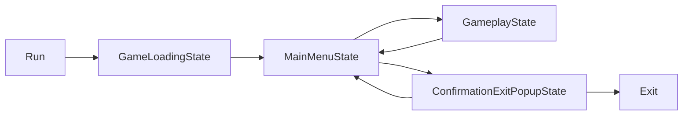

# UniState
 

UniState is an architectural framework for Unity, designed around State pattern. Offers high performance and excellent scalability, ideal for complex Unity projects.

## Table of Contents
<!-- TOC start (generated with https://github.com/derlin/bitdowntoc) -->

- [Installation](#installation)
    * [Requirements](#requirements)
    * [Option 1: Add package from git URL](#option-1-add-package-from-git-url)
    * [Option 2: Add via manifest.json](#option-2-add-via-manifestjson)
- [Simple State Machine Example](#simple-state-machine-example)
- [API Details and Usage](#api-details-and-usage)
    * [States](#states)
      - [State Creating](#state-creating)
      - [Examples](#examples)
        + [State Lifecycle](#state-lifecycle)
        + [State Transitions](#state-transitions)
    * [State Machine](#state-machine)
        + [Creating a State Machine](#creating-a-state-machine)
        + [Running a State Machine](#running-a-state-machine)
        + [Creating and Running a State Machine Inside States](#creating-and-running-a-state-machine-inside-states)
        + [State Machine Context](#state-machine-context)
    * [CompositeState](#compositestate)
        + [Creating a CompositeState](#creating-a-compositestate)
        + [SubState](#substate)
        + [DefaultCompositeState](#defaultcompositestate)
- [License](#license)

<!-- TOC end -->

## Installation

### Requirements
 * Requires Unity version that supports path query parameter for git packages (Unity >= 2020.1a21). 
 * Requires UniTask package installed. Guide regarding UniTask installation can be found on [Cysharp/UniTask README](https://github.com/Cysharp/UniTask/blob/master/README.md#upm-package).
 

### Option 1: Add package from git URL

You can add `https://github.com/bazyleu/UniState.git?path=Assets/UniState` to Package Manager.

It is a good practice to specify target version, UniState uses the `*.*.*` release tag so you can specify a version like `#1.1.0`. For example `https://github.com/bazyleu/UniState.git?path=Assets/UniState#1.1.0`.
You can find latest version number [here](https://github.com/bazyleu/UniState/releases). 


### Option 2: Add via manifest.json

You can add `"com.bazyleu.unistate": "https://github.com/bazyleu/UniState.git?path=Assets/UniState"` (or with version tag `https://github.com/bazyleu/UniState.git?path=Assets/UniState#1.1.0`) to `Packages/manifest.json`.


## Simple State Machine Example

In this section, we will explore how to create a simple architecture with UniSate using state machine.

The following diagram illustrates the state transitions for example game.



Here's an example of how the state classes can be implemented using UniState.

```csharp
   public class MainStateMachine : StateMachine
   {
   }

    public class GameLoadingState : StateBase
    {
        private ILoader _loader;

        public override async UniTask<StateTransitionInfo> Execute(CancellationToken token)
        {
            await _loader.Loading();

            return Transition.GoTo<MainMenuState>();
        }
    }

    public class MainMenuState : StateBase
    {
        private IMainMenu _mainMenu;

        public override async UniTask<StateTransitionInfo> Execute(CancellationToken token)
        {
            var action = await _mainMenu.GetAction();

            switch (action)
            {
                case "play":
                    return Transition.GoTo<GameplayState>();

                case "exit":
                    return Transition.GoTo<ConfirmationExitPopupState>();

                default:
                    return Transition.GoTo<ConfirmationExitPopupState>();
            }
        }
    }

    public class ConfirmationExitPopupState : StateBase
    {
        private IConfirmationPopup _confirmationPopup;

        public override async UniTask<StateTransitionInfo> Execute(CancellationToken token)
        {
            var confirm = await _confirmationPopup.ShowPopup();

            return confirm ? Transition.GoToExit() : Transition.GoBack();
        }
    }

    public class GameplayState : StateBase
    {
        public override async UniTask<StateTransitionInfo> Execute(CancellationToken token)
        {
            await Playloop();

            return Transition.GoBack();
        }

        private UniTask Playloop()
        {
            return UniTask.CompletedTask;
        }
    }
```
Here is how to bind these state classes using VContainer.

```csharp
    public class ExampleLifetimeScope : LifetimeScope
    {
        protected override void Configure(IContainerBuilder builder)
        {
            builder.Register<MainStateMachine>(Lifetime.Scoped);
            builder.Register<GameLoadingState>(Lifetime.Scoped);
            builder.Register<MainMenuState>(Lifetime.Scoped);
            builder.Register<ConfirmationExitPopupState>(Lifetime.Scoped);
            builder.Register<GameplayState>(Lifetime.Scoped);
        }
    }
```
Following code demonstrates how to run the state machine.

```csharp
    public class Game
    {
        private IObjectResolver _objectResolver;

        public async void Run()
        {
            CancellationTokenSource cts = new CancellationTokenSource();

            var stateMachine =  StateMachineHelper.CreateStateMachine<MainStateMachine>(_objectResolver.ToTypeResolver());
            await stateMachine.Execute<GameLoadingState>(cts.Token);
        }
    }
```

## API Details and Usage
 
### States

A state is a fundamental unit of logic in an application, often representing different screens or states, such as an idle scene, main menu, popup, or a specific state of a popup.

##### State Creating

To create your custom state, you can inherit from `StateBase` or `StateBase<T>`. Use `StateBase<T>` if you need to pass parameters to the state.

For highly customized states, you can manually implement the `IState<TPayload>` interface. However, in most cases, `StateBase` will suffice.

##### Examples

```csharp

// Simple State Inheritance
public class FooState : StateBase
{
    public override async UniTask<StateTransitionInfo> Execute(CancellationToken token)
    {
        // State logic here
    }
}

// State with Parameters
public class FooStateWithPayload : StateBase<FooPayload>
{
    public override async UniTask<StateTransitionInfo> Execute(CancellationToken token)
    {
        FooPayload payload = Payload; 
        // State logic here with payload
    }
}

//Custom State Implementation
public class CustomFooState : IState<MyParams>
{
    public async UniTask Initialize(CancellationToken token) 
    {
        // Initialization logic
    }

    public async UniTask<StateTransitionInfo> Execute(MyParams payload, CancellationToken token) 
    {
        // Execution logic with payload
    }

    public async UniTask Exit(CancellationToken token)
    {
        // Exit logic
    }

    public void Dispose()
    {
        // Cleanup logic
    }
}

```

#### State Lifecycle

The lifecycle of a state consists of four stages, represented by the following methods:

1. **Initialize**
    - Used for initializing resources, such as loading prefabs, subscribing to events, etc.

2. **Execute**
    - The only method that must be overridden in `StateBase`. It contains the main logic of the state and remains active until it returns a result with a transition to another state. For example, a state displaying a popup might wait for button presses and handle the result here. See the [State Transitions](#state-transitions) section for more details.

3. **Exit**
    - Completes the state's work, such as unsubscribing from buttons and closing the popup (e.g., playing a closing animation).

4. **Dispose**
    - Cleans up resources. If you inherit from `StateBase`, this method does not need implementation.

#### State Transitions

The `Execute` method of a state should return a `StateTransitionInfo` object, which dictates the next actions of the state machine. To simplify its generation, you can use the `Transition` property in `StateBase`. The possible transition options are:

1. **GoTo**
    - Used to transition to another state. If the state contains a payload, it should be passed to `GoTo`.

2. **GoBack**
    - Returns to the previous state. If there is no previous state (the current state is the first), it will exit the state machine. See the [State Machine](#state-machine) section for more details.

3. **GoToExit**
    - Exits the current state machine. See the [State Machine](#state-machine) section for more details.

### State Machine

The state machine is the entry point into the framework, responsible for running states.

#### Creating a State Machine

To create the initial state machine, use the helper `StateMachineHelper.CreateStateMachine<TSateMachine>(ITypeResolver typeResolver)`.

- **TSateMachine**: Any class implementing `IStateMachine`. You can use the standard `StateMachine` or create custom ones by inheriting from `StateMachine` or implementing `IStateMachine`.

- **ITypeResolver**: Used to create the state machine. It acts as a factory for creating states and other state machines. You can implement it yourself or use the provided implementation from DI frameworks like VContainer or Zenject via the `.ToTypeResolver()` extension.

#### Running a State Machine

After creating the state machine, you can run it with the specified state:

```csharp
await stateMachine.Execute<FooState>(cts.Token);

var payload = new BarPayload();
await stateMachine.Execute<BarState>(payload, cts.Token);
```

#### Creating and Running a State Machine Inside States

Any state can create and run a state machine within itself using the `StateMachineFactory` property. This is the recommended method for creating a state machine inside a state.

```csharp
ITypeResolver _newContext;

public UniTask<StateTransitionInfo> Execute(CancellationToken token)
{
var stateMachine = StateMachineFactory.Create<StateMachine>();
await stateMachine.Execute<FooState>(cts.Token);

    var stateMachineWithNewContext = StateMachineFactory.Create<StateMachine>(_newContext);
    await stateMachineWithNewContext.Execute<FooState>(cts.Token);
    ...
}
```

#### State Machine Context

UniState natively supports sub-containers and sub-contexts available in modern DI frameworks.

When creating a state machine inside a state, you can use two method overloads:

- `StateMachineFactory.Create<TSateMachine>()`
- `StateMachineFactory.Create<TSateMachine>(ITypeResolver typeResolver)`

If the version without `ITypeResolver` is used, the context is inherited from the parent state machine. If `ITypeResolver` is passed, it will have a new context.

For smaller projects, it's recommended to use the simplified version without creating a new context:

```csharp
StateMachineFactory.Create<TSateMachine>();
```

For larger projects using sub-containers/sub-contexts in your DI framework to manage resources more efficiently, you can pass them into `Create` to force the state machine to use them for creating states and dependencies. Thus, UniState supports this natively without additional actions required from you.

### CompositeState

CompositeState is essential for complex areas of an application likely to be worked on by multiple people simultaneously. They consist of various independent SubStates, each with its own logic.

#### Creating a CompositeState

To create a composite state, inherit from `CompositeStateBase` (or implement the `ICompositeState` interface for more detailed control). You can also use the ready-made implementation `DefaultCompositeState` (see the [DefaultCompositeState](#defaultcompositestate) section). No additional actions are needed.

#### SubState

SubStates are states tied to a CompositeState, created and run simultaneously with it. To create a SubState, inherit from `SubStateBase` or implement the `ISubState` interface for greater customization. When creating a SubState, specify the parent composite state as a generic parameter, e.g., `FooSubState : SubStateBase<BarCompositeState>`. In all other aspects, it functions like a regular state.

#### DefaultCompositeState

A ready-to-use implementation for a composite state that propagates `Initialize`, `Execute`, and `Exit` methods to all SubStates within it. The result of the `Execute` method will be the first completed `Execute` method among all SubStates.

## License
 
This library is under the MIT License. Full text is [here](LICENSE).