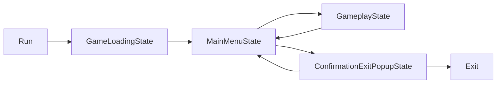

UniState
===

UniState is an architectural framework for Unity, designed around State pattern. Offers high performance and excellent scalability, ideal for complex Unity projects.

## Table of Contents
- [Installation](#installation)
- [Simple State Machine Example](#simple-state-machine-example)
- [License](#license)

Installation
---

### Requirements
 * Requires Unity version that supports path query parameter for git packages (Unity >= 2020.1a21). 
 * Requires UniTask package installed. Guide regarding UniTask installation can be found on [Cysharp/UniTask README](https://github.com/Cysharp/UniTask/blob/master/README.md#upm-package).
 

### Add package from git URL

You can add `https://github.com/bazyleu/UniState.git?path=Assets/UniState` to Package Manager


### _(Alternative)_ Add via manifest.json

Alternatively you can add `"com.bazyleu.unistate": "https://github.com/bazyleu/UniState.git?path=Assets/UniState"` to `Packages/manifest.json`.

If you want to set a target version, UniState uses the `*.*.*` release tag so you can specify a version like `#1.1.0`. For example `https://github.com/bazyleu/UniState.git?path=Assets/UniState#1.1.0`.


Simple State Machine Example
---
In this section, we will explore how to create a simple architecture with UniSate using state machine.

The following diagram illustrates the state transitions for example game.



Here's an example of how the state classes can be implemented using UniState.

```csharp
   public class MainStateMachine : StateMachine
   {
   }

    public class GameLoadingState : StateBase
    {
        private ILoader _loader;

        public override async UniTask<StateTransitionInfo> Execute(CancellationToken token)
        {
            await _loader.Loading();

            return Transition.GoTo<MainMenuState>();
        }
    }

    public class MainMenuState : StateBase
    {
        private IMainMenu _mainMenu;

        public override async UniTask<StateTransitionInfo> Execute(CancellationToken token)
        {
            var action = await _mainMenu.GetAction();

            switch (action)
            {
                case "play":
                    return Transition.GoTo<GameplayState>();

                case "exit":
                    return Transition.GoTo<ConfirmationExitPopupState>();

                default:
                    return Transition.GoTo<ConfirmationExitPopupState>();
            }
        }
    }

    public class ConfirmationExitPopupState : StateBase
    {
        private IConfirmationPopup _confirmationPopup;

        public override async UniTask<StateTransitionInfo> Execute(CancellationToken token)
        {
            var confirm = await _confirmationPopup.ShowPopup();

            return confirm ? Transition.GoToExit() : Transition.GoBack();
        }
    }

    public class GameplayState : StateBase
    {
        public override async UniTask<StateTransitionInfo> Execute(CancellationToken token)
        {
            await Playloop();

            return Transition.GoBack();
        }

        private UniTask Playloop()
        {
            return UniTask.CompletedTask;
        }
    }
```
Here is how to bind these state classes using VContainer.

```csharp
    public class ExampleLifetimeScope : LifetimeScope
    {
        protected override void Configure(IContainerBuilder builder)
        {
            builder.Register<MainStateMachine>(Lifetime.Scoped);
            builder.Register<GameLoadingState>(Lifetime.Scoped);
            builder.Register<MainMenuState>(Lifetime.Scoped);
            builder.Register<ConfirmationExitPopupState>(Lifetime.Scoped);
            builder.Register<GameplayState>(Lifetime.Scoped);
        }
    }
```
Following code demonstrates how to run the state machine.

```csharp
    public class Game
    {
        private IObjectResolver _objectResolver;

        public async void Run()
        {
            CancellationTokenSource cts = new CancellationTokenSource();

            var stateMachine =  StateMachineHelper.CreateStateMachine<MainStateMachine>(_objectResolver.ToTypeResolver());
            await stateMachine.Execute<GameLoadingState>(cts.Token);
        }
    }
```
License
---
This library is under the MIT License. Full text is [here](LICENSE).