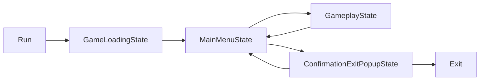

# UniState

[](https://github.com/bazyleu/UniState/releases)
[](https://github.com/bazyleu/UniState/releases)
[](https://github.com/bazyleu/UniState/actions)
[](https://github.com/bazyleu/UniState/branches)
[](LICENSE)

UniState is an architectural framework for Unity, designed around State pattern. Offers high performance and excellent
scalability, ideal for complex Unity projects.

## Table of Contents

<!-- TOC start (generated with https://github.com/derlin/bitdowntoc) -->

- [Installation](#installation)
    * [Requirements](#requirements)
    * [Option 1: Add package from git URL](#option-1-add-package-from-git-url)
    * [Option 2: Add via manifest.json](#option-2-add-via-manifestjson)
- [Getting Started](#getting-started)
- [Framework Philosophy](#framework-philosophy)
  + [Dependency Injection](#dependency-injection)
- [API Details and Usage](#api-details-and-usage)
    * [State](#state)
        + [State Creating](#state-creating)
        + [State Lifecycle](#state-lifecycle)
        + [State Transitions](#state-transitions)
        + [Disposables](#disposables)
        + [State Behavior Attribute](#state-behavior-attribute)
    * [State Machine](#state-machine)
        + [Creating a State Machine](#creating-a-state-machine)
        + [Running a State Machine](#running-a-state-machine)
        + [Creating and Running a State Machine Inside States](#creating-and-running-a-state-machine-inside-states)
        + [Custom type resolvers](#custom-type-resolvers)
        + [State Machine Context](#state-machine-context)
        + [State Machine Custom Interface ](#state-machine-custom-interface)
        + [State Machine Error Handling](#state-machine-error-handling)
    * [Composite State](#composite-state)
        + [Creating a Composite State](#creating-a-composite-state)
        + [SubState](#substate)
        + [Default Composite State](#default-composite-state)
- [Integrations](#integrations)
    * [VContainer](#vcontainer)
        + [VContainer Preparation](#vcontainer-preparation)
        + [VContainer Usage](#vcontainer-usage)
        + [VContainer Registering](#vcontainer-registering)
    * [Zenject (Extenject)](#zenject-extenject)
        + [Zenject Preparation](#zenject-preparation)
        + [Zenject Usage](#zenject-usage)
        + [Zenject Registering](#zenject-registering)
- [License](#license)

<!-- TOC end -->

## Installation

### Requirements

* Requires Unity version 2022.3 or higher.
* Requires UniTask package installed. Guide regarding UniTask installation can be found
  on [Cysharp/UniTask README](https://github.com/Cysharp/UniTask/blob/master/README.md#upm-package).

### Option 1: Add package from git URL

You can add `https://github.com/bazyleu/UniState.git?path=Assets/UniState` to Package Manager.

It is a good practice to specify target version, UniState uses the `*.*.*` release tag so you can specify a version
like `#1.1.0`. For example `https://github.com/bazyleu/UniState.git?path=Assets/UniState#1.1.0`.
You can find latest version number [here](https://github.com/bazyleu/UniState/releases).


### Option 2: Add via manifest.json

You can add `"com.bazyleu.unistate": "https://github.com/bazyleu/UniState.git?path=Assets/UniState"` (or with version
tag `https://github.com/bazyleu/UniState.git?path=Assets/UniState#1.1.0`) to `Packages/manifest.json`.

## Getting Started

In this section, we will explore how to create a simple architecture with UniSate using state machine.

The following diagram illustrates the state transitions for example game.



Here's an example of how the state classes can be implemented using UniState.

```csharp
   public class MainStateMachine : StateMachine
   {
   }

    public class GameLoadingState : StateBase
    {
        private ILoader _loader;

        public GameLoadingState(ILoader loader)
        {
            _loader = loader;
        }

        public override async UniTask<StateTransitionInfo> Execute(CancellationToken token)
        {
            await _loader.Loading();

            return Transition.GoTo<MainMenuState>();
        }
    }

    public class MainMenuState : StateBase
    {
        private IMainMenu _mainMenu;

        public MainMenuState(IMainMenu mainMenu)
        {
            _mainMenu = mainMenu;
        }

        public override async UniTask<StateTransitionInfo> Execute(CancellationToken token)
        {
            var action = await _mainMenu.GetAction();

            switch (action)
            {
                case "play":
                    return Transition.GoTo<GameplayState>();

                case "exit":
                    return Transition.GoTo<ConfirmationExitPopupState>();

                default:
                    return Transition.GoTo<ConfirmationExitPopupState>();
            }
        }
    }

    public class ConfirmationExitPopupState : StateBase
    {
        private IConfirmationPopup _confirmationPopup;

        public ConfirmationExitPopupState(IConfirmationPopup confirmationPopup)
        {
            _confirmationPopup = _confirmationPopup;
        }

        public override async UniTask<StateTransitionInfo> Execute(CancellationToken token)
        {
            var confirm = await _confirmationPopup.ShowPopup();

            return confirm ? Transition.GoToExit() : Transition.GoBack();
        }
    }

    public class GameplayState : StateBase
    {
        public override async UniTask<StateTransitionInfo> Execute(CancellationToken token)
        {
            await Playloop();

            return Transition.GoBack();
        }

        private UniTask Playloop()
        {
            return UniTask.CompletedTask;
        }
    }
```

Here is how to bind these state classes using VContainer 
(details of the VContainer bindings can be found here [VContainer Registering](#vcontainer-registering)).

```csharp
    public class ExampleLifetimeScope : LifetimeScope
    {
        protected override void Configure(IContainerBuilder builder)
        {
            builder.RegisterStateMachine<MainStateMachine>();
            builder.RegisterState<GameLoadingState>();
            builder.RegisterState<MainMenuState>();
            builder.RegisterState<ConfirmationExitPopupState>();
            builder.RegisterState<GameplayState>();
            
            // Register other dependencies 
        }
    }
```

Here is how to bind these state classes using Zenject/Extenject 
(details of the VContainer bindings can be found here [Zenject Registering](#zenject-registering)).

```csharp
public class FooInstaller : MonoInstaller
{
    public override void InstallBindings()
    {
        Container.BindStateMachine<MainStateMachine>();
        Container.BindState<GameLoadingState>();
        Container.BindState<MainMenuState>();
        Container.BindState<ConfirmationExitPopupState>();
        Container.BindState<GameplayState>();
        
        // Register other dependencies 
    }
}
```

Following code demonstrates how to run the state machine.

```csharp
    public class Game
    {
        private IObjectResolver _objectResolver;

        public async void Run()
        {
            CancellationTokenSource cts = new CancellationTokenSource();

            var stateMachine =  StateMachineHelper.CreateStateMachine<MainStateMachine>(_objectResolver.ToTypeResolver());
            await stateMachine.Execute<GameLoadingState>(cts.Token);
        }
    }
```

## Framework Philosophy

#### Dependency Injection

All dependencies for states, commands, and other entities should be passed through the constructor.
UniState supports automatic integration with the most popular DI frameworks for Unity.
Refer to the [integration documentation](#integrations) for more details.
Dependencies must be registered in your DI framework, and they will automatically be resolved when
creating [state](#states), [state machine](#state-machine).

## API Details and Usage

### State

A state is a fundamental unit of logic in an application, often representing different screens or states, such as an
idle scene, main menu, popup, or a specific state of a popup.

#### State Creating

To create your custom state, you can inherit from `StateBase` or `StateBase<T>`. Use `StateBase<T>` if you need to pass
parameters to the state.

For highly customized states, you can manually implement the `IState<TPayload>` interface. However, in most
cases, `StateBase` will suffice.

```csharp

// Simple State Inheritance
public class FooState : StateBase
{
    public override async UniTask<StateTransitionInfo> Execute(CancellationToken token)
    {
        // State logic here
    }
}

// State with Parameters
public class FooStateWithPayload : StateBase<FooPayload>
{
    public override async UniTask<StateTransitionInfo> Execute(CancellationToken token)
    {
        // Get payload
        FooPayload payload = Payload; 
        
        // State logic with payload here
    }
}

//Custom State Implementation
public class CustomFooState : IState<MyParams>
{
    public async UniTask Initialize(CancellationToken token) 
    {
        // Initialization logic
    }

    public async UniTask<StateTransitionInfo> Execute(MyParams payload, CancellationToken token) 
    {
        // Execution logic with payload
    }

    public async UniTask Exit(CancellationToken token)
    {
        // Exit logic
    }

    public void Dispose()
    {
        // Cleanup logic
    }
}

```

#### State Lifecycle

The lifecycle of a state consists of four stages, represented by the following methods:

1. **Initialize**
    - Used for initializing resources, such as loading prefabs, subscribing to events, etc.

2. **Execute**
    - The only method that must be overridden in `StateBase`. It contains the main logic of the state and remains active
      until it returns a result with a transition to another state. For example, a state displaying a popup might wait
      for button presses and handle the result here. See the [State Transitions](#state-transitions) section for more
      details.

3. **Exit**
    - Completes the state's work, such as unsubscribing from buttons and closing the popup (e.g., playing a closing
      animation).

4. **Dispose**
    - Cleans up resources. If you inherit from `StateBase`, this method does not need implementation.

#### State Transitions

The `Execute` method of a state should return a `StateTransitionInfo` object, which dictates the next actions of the
state machine. To simplify its generation, you can use the `Transition` property in `StateBase`. The possible transition
options are:

1. **GoTo**
    - Used to transition to another state. If the state contains a payload, it should be passed to `GoTo`.

2. **GoBack**
    - Returns to the previous state. If there is no previous state (the current state is the first), it will exit the
      state machine. See the [State Machine](#state-machine) section for more details.

3. **GoToExit**
    - Exits the current state machine. See the [State Machine](#state-machine) section for more details.

```csharp
public class ExampleState : StateBase
{
    public override async UniTask<StateTransitionInfo> Execute(CancellationToken token)
    {
        var transition = await DoSomeAsyncLogic(token);

        switch (transition)
        {
            case TransitionExample.GoTo:
                return Transition.GoTo<FooState>();

            case TransitionExample.GoToWithPayload:
                var payload = 42;
                return Transition.GoTo<BarState, int>(payload);

            case TransitionExample.GoToAbstract:
                return Transition.GoTo<IFooState>();

            case TransitionExample.GoBack:
                return Transition.GoBack();

            case TransitionExample.GoToExit:
                return Transition.GoToExit();

            default:
                return Transition.GoToExit();
        }
    }

    private UniTask<TransitionExample> DoSomeAsyncLogic(CancellationToken token)
    {
        // Some logic here
        return UniTask.FromResult(TransitionExample.GoTo);
    }
}
```

#### Disposables

Disposables are a part of `StateBase` that allow users to tie `IDisposable` references and delegates to state's
lifetime, guaranteeing disposal and delegate execution on state's `Dispose`, without overriding the method

```csharp
public class LoadingState : StateBase<ILoadingScreenView>
{
    private CancellationTokenSource _loadingCts;

    public override async UniTask<StateTransitionInfo> Execute(CancellationToken token)
    {
        // State's disposable references
        _loadingCts = CancellationTokenSource.CreateLinkedTokenSource(token);
        Disposables.Add(_loadingCts);

        // Handling of subscriptions with locality of behaviour
        Payload.CancelClicked += OnCancelLoadingClicked;        
        Disposables.Add(() => Payload.CancelClicked -= OnCancelLoadingClicked);

        try
        {
            await Payload.PretendToWork(_loadingCts.Token);
        }
        catch (OperationCancelledException) when (!token.IsCancellationRequested)
        {
            return Transition.GoBack();
        }

        return Transition.GoTo<NextState>();
    }
    
    private void OnCancelLoadingClicked()
    {
        _loadingCts.Cancel();
    }
}
```

#### State Behavior Attribute

It is possible to customize the behavior of a specific state using the `StateBehaviour` attribute.

This attribute has the following parameters:

- **ProhibitReturnToState** (default value: false): When enabled, this state cannot be returned to
  via `Transition.GoBack()`. The state with this attribute will be skipped, and control will return to the state before
  it. This behavior can be useful for states that represent 'loading', there is no point of returning to loading.

- **InitializeOnStateTransition** (default value: false): When enabled, the initialization of the state will begin
  before exiting the previous state. Technically, this means `Initialize()` of the state will be called before `Exit()`
  of the previous state. This behavior can be useful for seamless transitions in complex animations, where the state
  represents only part of the animation.

```csharp
[StateBehaviour(ProhibitReturnToState = true)]
public class FooState: StateBase
{
    //...
}

[StateBehaviour(InitializeOnStateTransition = true)]
public class BarState: StateBase
{
    //...
}

[StateBehaviour(InitializeOnStateTransition = true, ProhibitReturnToState = true)]
public class BazState: StateBase
{
    //...
}
```

### State Machine

The state machine is the entry point into the framework, responsible for running states.

#### Creating a State Machine

To create the initial state machine, use the
helper `StateMachineHelper.CreateStateMachine<TSateMachine>(ITypeResolver typeResolver)`.

- **TSateMachine**: Any class implementing `IStateMachine`. You can use the standard `StateMachine` or create custom
  ones by inheriting from `StateMachine` or implementing `IStateMachine`.

- **ITypeResolver**: Used to create the state machine. It acts as a factory for creating states and other state
  machines. You can implement it yourself or use the provided implementation from DI frameworks like VContainer or
  Zenject via the `.ToTypeResolver()` extension. See [Integrations](#integrations) for supported frameworks
  or [Custom type resolvers](#custom-type-resolvers) for cases if you DI framework is not supported out of the box or
  you do not have DI framework.

#### Running a State Machine

After creating the state machine, you can run it with the specified state:

```csharp
await stateMachine.Execute<FooState>(cts.Token);

var payload = new BarPayload();
await stateMachine.Execute<BarState>(payload, cts.Token);
```

#### Creating and Running a State Machine Inside States

Any state can create and run a state machine within itself using the `StateMachineFactory` property. This is the
recommended method for creating a state machine inside a state.

```csharp
ITypeResolver _newContext;

public UniTask<StateTransitionInfo> Execute(CancellationToken token)
{
    var stateMachine = StateMachineFactory.Create<StateMachine>();
    await stateMachine.Execute<FooState>(cts.Token);

    var stateMachineWithNewContext = StateMachineFactory.Create<StateMachine>(_newContext);
    await stateMachineWithNewContext.Execute<FooState>(cts.Token);
    ...
}
```

#### Custom type resolvers

While UniState provides `ITypeResolver` implementations for modern DI frameworks out of the box, you can create custom implementations, tailored to your needs

An example of `ITypeResolver` with automatic state bindings for Zenject/Extenject:
```csharp
public class ZenjectAutoBindTypeResolver : ITypeResolver
{
    ...

    public object Resolve(Type type)
    {
        if (!type.IsAbstract && !type.IsInterface && !_container.HasBinding(type))
        {
            _container.BindState(type);
        }

        return _container.Resolve(type);
    }
}
```

If you do not have DI framework you have to implement ITypeResolver by your own by manually creating requested states and
state machines.

#### State Machine Context

UniState natively supports sub-containers and sub-contexts available in modern DI frameworks.

When creating a state machine inside a state, you can use two method overloads:

- `StateMachineFactory.Create<TSateMachine>()`
- `StateMachineFactory.Create<TSateMachine>(ITypeResolver typeResolver)`

If the version without `ITypeResolver` is used, the context is inherited from the parent state machine.
If `ITypeResolver` is passed, it will have a new context.

For smaller projects, it's recommended to use the simplified version without creating a new context:

```csharp
StateMachineFactory.Create<TSateMachine>();
```

For larger projects using sub-containers/sub-contexts in your DI framework to manage resources more efficiently, you can
pass them into `Create` to force the state machine to use them for creating states and dependencies. Thus, UniState
supports this natively without additional actions required from you.

#### State Machine Custom Interface 

When creating a state machine, you can use your custom interface. Interface should be inherit from `IStateMachine`. This
allows to implement additional, customized behavior.

```csharp
public interface IExtendedStateMachine : IStateMachine
{
    public void RunCustomLogic();
}
```

Once your custom interface is implemented, you can utilize a special version of the API that returns your interface.
This can be useful for adding custom logic to the state machine.

```csharp
// Option 1: Creating ExtendedStateMachine as entry point
var stateMachine = StateMachineHelper.CreateStateMachine<ExtendedStateMachine, IExtendedStateMachine>(
                    typeResolver);

// Option 2: Creating ExtendedStateMachine inside states
var stateMachine = StateMachineFactory.Create<ExtendedStateMachine, IExtendedStateMachine>();

// Custom state machine has extended api that is defined by IExtendedStateMachine interface
stateMachine.RunCustomLogic();

// Custom state machine can run states like default state machine
await stateMachine.Execute<FooState>(cancellationToken);
```

#### State Machine Error Handling

If an exception occurs in a state, the state machine will catch and handle it. If the exception happens during the
state's `Initialize()` or `Exit()` methods, the state machine will continue as if the exception did not occur. If an
exception occurs in the state's `Execute()` method, the state machine will automatically perform a `GoBack` operation,
as if the method had returned `Transition.GoBack()`.

Exceptions will not be propagated further, except for `OperationCanceledException`. When an `OperationCanceledException`
is encountered, the state machine will stop execution.

To intercept exceptions and add custom handlers, you can override the `HandleError()` method in your state machine that
inherits from `StateMachine`. This method will be called whenever the state machine processes an exception.

```csharp
public class BarStateMachine : StateMachine
{
    protected override void HandleError(StateMachineErrorData errorData)
    {
        // Custom logic here
    }
}
```
`StateMachineErrorData` contains metadata related to exceptions. Be aware that `StateMachineErrorData.State` may be null
when `StateMachineErrorData.ErrorType` is `StateMachineErrorType.StateMachineFail`.

If you wish to halt the state machine's execution following an exception, you can use the `throw` statement, which will stop execution.

In the example provided, the state machine will terminate after encountering a second exception within the same state.

```csharp
public class FooStateMachine : StateMachine
{
    private Type _lastErrorState;

    protected override void HandleError(StateMachineErrorData errorData)
    {
        var stateType = errorData.State?.GetType();

        if (stateType != null && _lastErrorState == stateType)
        {
            // Stop state mahine execution and throw an exception out
            throw new Exception($"Second exception in same state.", errorData.Exception);
        }

        _lastErrorState = stateType;
    }
}
```

### Composite State

Composite State is essential for complex areas of an application likely to be worked on by multiple people
simultaneously. They consist of various independent sub states, each with its own logic.

#### Creating a Composite State

To create a composite state, inherit from `CompositeStateBase` (or implement the `ICompositeState` interface for more
detailed control). You can also use the ready-made implementation `DefaultCompositeState` (see
the [DefaultCompositeState](#defaultcompositestate) section). No additional actions are needed.

#### SubState

SubStates are states tied to a composite state, created and run simultaneously with it. To create a SubState, inherit
from `SubStateBase` or implement the `ISubState` interface for greater customization. When creating a sub state, specify
the parent composite state as a generic parameter, e.g., `FooSubState : SubStateBase<BarCompositeState>`. In all other
aspects, it functions like a regular state.

#### Default Composite State

A ready-to-use implementation for a composite state that propagates `Initialize`, `Execute`, and `Exit` methods to all
SubStates within it. The result of the `Execute` method will be the first completed `Execute` method among all sub
states.

If you use `DefaultCompositeState` and it is executed without any SubStates, its `Execute` method will throw
an `InvalidOperationException`.

To use `DefaultCompositeState`, simply inherit your composite state from it. Here's an example:
```csharp
internal class FooCompositeState : DefaultCompositeState
{
}

internal class BazSubState : SubStateBase<DefaultCompositeState>
{
}

internal class BarSubState : SubStateBase<DefaultCompositeState>
{
}
```

## Integrations

UniState supports integrations with the most popular DI containers. If these frameworks are installed via UPM,
everything will work out of the box, and no additional actions are required.

### VContainer

GitHub: [VContainer](https://github.com/hadashiA/VContainer)

#### VContainer Preparation

If the VContainer is installed via UPM, you can skip this step and proceed to the [VContainer Usage](#vcontainer-usage)
section.
If the package is not installed via UPM, you need to manually add the `UNISTATE_VCONTAINER_SUPPORT` define symbol in
Scripting Define Symbols (Player Settings -> Player -> Scripting Define Symbols).

#### VContainer Usage

To use it, convert `VContainer.IObjectResolver` to `UniState.ITypeResolver` by calling the extension `ToTypeResolver()`
and pass it to the state machine.

```csharp
// Object resolver with main or child scope from VContainer
VContainer.IObjectResolver _objectResolver;

// Convert VContainer.IObjectResolver to ITypeResolver.TypeResolver
var typeResolver = _objectResolver.ToTypeResolver();

// Create state machine with VContainer support
var stateMachine =  StateMachineHelper.CreateStateMachine<StateMachine>(typeResolver);
```

#### VContainer Registering

All state machines, states and their dependencies should be registered in DI container.
For convenient registering of states and state machines, special extension methods are available. The main ones
are `RegisterStateMachine` and `RegisterState`, which register both the classes themselves and all interfaces implemented by
these classes.

However, if you need to implement a transition into a state or launch a state machine via a base/abstract class, you
should use `RegisterAbstractStateMachine` and `RegisterAbstractState`.

Here's an example code:
```csharp
private void RegisterStates(IContainerBuilder builder)
{
    // Use this registration creating state machine via class or interface.
    // For example: StateMachineHelper.CreateStateMachine<BarStateMachine>(...) 
    // For example: StateMachineHelper.CreateStateMachine<IBarStateMachine>(...) 
    builder.RegisterStateMachine<BarStateMachine>();
    
    // Use this registration creating state machine via base/abstract class.
    // For example: StateMachineHelper.CreateStateMachine<FooStateMachineBase>(...) 
    builder.RegisterAbstractStateMachine<FooStateMachineBase, FooStateMachine>();
    
    // Use this registration for transitions to class or interface.
    // For example: Transition.GoTo<BarState>() or Transition.GoTo<IBarState>()
    builder.RegisterState<BarState>();
    
    // Use this registration for transitions to base/abstract class.
    // For example: Transition.GoTo<FooStateBase>()
    builder.RegisterAbstractState<FooStateBase, FooState>();
}
```
You can always skip the extensions and register directly if you need custom behavior.

### Zenject (Extenject)

GitHub: [Extenject](https://github.com/Mathijs-Bakker/Extenject) or [Zenject](https://github.com/modesttree/Zenject)

#### Zenject Preparation

If the Zenject / Extenject is installed via UPM, you can skip this step and proceed to
the [Zenject Usage](#zenject-usage) section.
If the package is not installed via UPM, you need to manually add the `UNISTATE_ZENJECT_SUPPORT` define symbol in
Scripting Define Symbols (Player Settings -> Player -> Scripting Define Symbols).

#### Zenject Usage

To use it, convert `Zenject.DiContainer` to `UniState.ITypeResolver` by calling the extension `ToTypeResolver()` and
pass it to the state machine.

```csharp
// Zenject container / sub container
Zenject.DiContainer container;

// Convert Zenject.DiContainer to ITypeResolver.TypeResolver
var typeResolver = container.ToTypeResolver();

// Create state machine with Zenject support
var stateMachine =  StateMachineHelper.CreateStateMachine<StateMachine>(typeResolver);
```

#### Zenject Registering

All state machines, states and their dependencies should be registered in DI container.
For convenient registering of states and state machines, special extension methods are available. The main ones
are `BindStateMachine` and `BindState`, which bind both the classes themselves and all interfaces implemented by
these classes.

However, if you need to implement a transition into a state or launch a state machine via a base/abstract class, you
should use `BindAbstractStateMachine` and `BindAbstractState`.

Here's an example code:
```csharp
private void BindStates(DiContainer container)
{
    // Use this registration creating state machine via class or interface.
    // For example: StateMachineHelper.CreateStateMachine<BarStateMachine>(...) 
    // For example: StateMachineHelper.CreateStateMachine<IBarStateMachine>(...) 
    container.BindStateMachine<BarStateMachine>();
    
    // Use this registration creating state machine via base/abstract class.
    // For example: StateMachineHelper.CreateStateMachine<FooStateMachineBase>(...) 
    container.BindAbstractStateMachine<FooStateMachineBase, FooStateMachine>();

    // Use this registration for transitions to class or interface.
    // For example: Transition.GoTo<BarState>() or Transition.GoTo<IBarState>()
    container.BindState<BarState>();
    
    // Use this registration for transitions to base/abstract class.
    // For example: Transition.GoTo<FooStateBase>()
    container.BindAbstractState<FooStateBase, FooState>();
}
```

## License

This library is under the MIT License. Full text is [here](LICENSE).